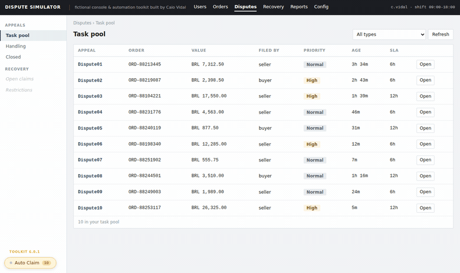

# Dispute Simulator

Elucidation of five browser userscripts that automate the mechanical part of handling a payment dispute — consolidating key information, messaging the right party, setting deadlines, writing case notes, filing the case — while leaving every judgement call to the operator.

They run on a simulated dispute console I built to demo them.

[](https://github.com/cvidal22/peerledger-workflow-toolkit/actions/workflows/ci.yml)



---

## Try it — 30 seconds, nothing to install

**[Open the demo →](https://cvidal22.github.io/peerledger-workflow-toolkit/?toolkit=1)**

1. Press **Auto Claim** (bottom left) — it goes to the task pool and opens the top case
2. Press **Macros**, type `request proof`, hit Enter
3. Watch it run all the steps automatically

It messages the seller in their own language, sets a 12-hour deadline, writes and saves the case note, files the case under Handling, and returns you to the queue. Each step is outlined on screen as it happens.

Then try **Dispute08**, where the buyer writes Portuguese. The message goes out in Portuguese; the internal note stays in English.

---

## Why I built it

Part of my work at a crypto exchange is handling peer-to-peer payment disputes — two counterparties, one failed trade, conflicting arguments, evidence of mixed quality (sometimes edited/fake proofs), and an outcome that has to pass an audit months later. It's basically fraud assessment: the calls involve real money and someone is usually lying.

That part is judgement, and it shouldn't be automated. But a fixed sequence wraps around every one of those decisions and some of it is: getting to the next case, gathering context spread across all panels, searching the chat for red flags, then messaging the right party, setting a deadline, writing a structured note, filing the case.

Nobody asked me to fix that. I started doing for myself, measuring what that second category cost, built against it, and kept going. Identifying what could be automated, and developing — the suite is now about 95 different automated scripts and they were adopted as standard practice across the team.

This repository is that project, rebuilt from scratch on an invented platform so I can show it publicly. No employer code, terminology or interface is in here.

**If you want the reasoning rather than the demo, read [the notes](ENGINEERING-NOTES.md)** — six minutes, and it's the part I'd want reviewed.

---

## What a macro actually does

Picking `RWP · Request proof` runs four steps:

| | Step | Detail |
|---|---|---|
| 1 | Message the seller | Translated into the language that party writes in |
| 2 | Set a 12-hour deadline | If already handled previously, carried forward from the previous set one, not restarted |
| 3 | Write and save the note | Verified by a unique marker, and pasted on a tracker |
| 4 | File under Handling | Then return to the task pool |

What it requests, and how long they get are predetermined per SOP, not chosen each run. Otherwise two identical cases end up with different deadlines and nobody can say which was right.

Six main case types × eight actions = **48 macros, all generated from one skeleton**. mainly the wording differs per type, so a fix to sequencing or verification lands in 48 cases.

| Code | What happened | Filed by |
|---|---|---|
| `RWP` | Released without payment | seller |
| `CBP` | Cancelled but paid | buyer |
| `CBK` | Chargeback after release | seller |
| `OVP` | Overpaid | buyer |
| `UND` | Underpaid | seller |
| `BAF` | Bank account frozen | seller |

---

## Three buttons

| Button | Where | What it does |
|---|---|---|
| **Auto Claim** | Anywhere | Opens the next case in the task pool |
| **Brief** | Dispute page | Summarize and order facts, buyer vs seller, evidence, flagged chat lines |
| **Macros** | Dispute page  | Every macro for each case type |


They're yellow intentionally by design, because they aren't part of the platform. Nobody should have to work out whether a button belongs to the product or to a script.

**Queue model:** Task pool → Handling → Closed. Every macro ends by parking the case or closing it. Never both, never neither.

---

## How it's built

```
5 scripts  →  pl-core.js  →  the page
              └─ adapter is the only part that touches the DOM
```

Everything else works on plain objects. When the platform redesigns something, one function breaks instead of five scripts, making it easy to identify and update.

The core handles multi-step actions with verification between steps, polling with backoff, timers that survive connectivity and background tab, strict templates that throw rather than half-render, per-party language detection, and save verification by unique marker.

That last one matters more than it sounds: verification by unique marker avoids counting rows to confirm a save that could be satisfied by a *colleague's* write landing at the same moment, so it would report success for something that never happened.

Detail in [`guide/ARCHITECTURE.md`](guide/ARCHITECTURE.md) and [`guide/dom-cookbook.md`](guide/dom-cookbook.md).

---

## Running it on non-demo version

Open `docs/index.html` — it loads itself, nothing to install. See [`guide/DEVELOPING.md`](guide/DEVELOPING.md).

To run it properly as userscripts, install [Tampermonkey](https://www.tampermonkey.net/) and click each:
[Auto-Claim](https://raw.githubusercontent.com/cvidal22/peerledger-workflow-toolkit/main/scripts/queue-auto-claim.user.js) ·
[Signal Surfacer](https://raw.githubusercontent.com/cvidal22/peerledger-workflow-toolkit/main/scripts/signal-surfacer.user.js) ·
[Context Aggregator](https://raw.githubusercontent.com/cvidal22/peerledger-workflow-toolkit/main/scripts/context-aggregator.user.js) ·
[Macro Engine](https://raw.githubusercontent.com/cvidal22/peerledger-workflow-toolkit/main/scripts/macro-engine.user.js) ·
[Macro Launcher](https://raw.githubusercontent.com/cvidal22/peerledger-workflow-toolkit/main/scripts/macro-launcher.user.js)

Order doesn't matter. 

`Alt+A` next case · `Alt+K` macros · `Alt+P` task pool · `Alt+2` jump to chat

```
core/     the shared runtime
scripts/  the five userscripts
docs/     the demo console
guide/    architecture, DOM notes, troubleshooting
build/    validation and the demo bundle
tests/    jsdom harness driving the real page
```

```bash
npm test   # validation + 5 test files, including one that checks this README is accurate
```

The validator isn't ceremony. A userscript with a syntax error fails *silently* — the extension accepts it, it never runs, and your only clue is a button that stopped appearing.

---

## Where the real project stands

About 95 scripts across six case types, running at roughly double the team throughput target pace. In active use by colleagues, with formal rollout and internal audit continuously in progress. Thirteen process improvements I developed alongside it were adopted as standard practice and works in synergy with this project.

Colleagues depending on it is what shaped the engineering. Tooling for individual purpose can fail quietly, because you know what it does. Tooling other people rely on has to survive workflows you didn't design for and operators who won't read your notes.

---

Not a scraper — the `@match` only targets the demo. Not a decision system: five scripts, zero verdicts.

MIT licensed. **Caio Vidal** · [LinkedIn](https://www.linkedin.com/in/caiovidal22/)
